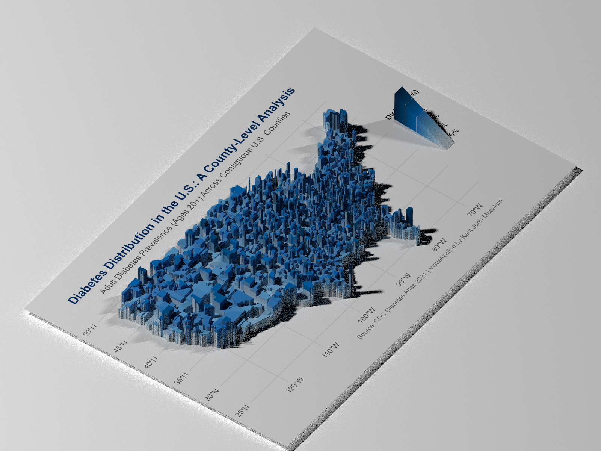
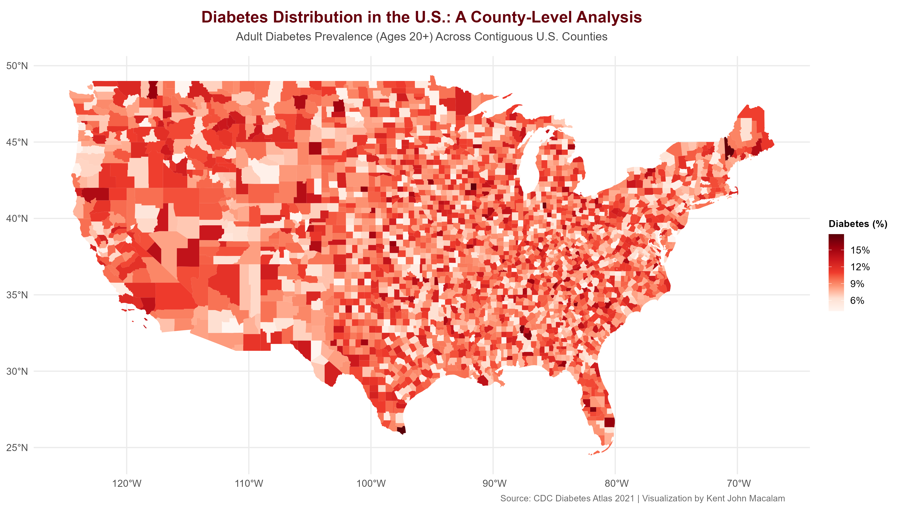

# U.S. Diabetes 3D Choropleth Map

> An interactive 3D visualization and rayshader mapping of adult diabetes prevalence across all contiguous U.S. counties using CDC data.

**Authors:** Kent John Macalam &nbsp;|&nbsp; **Date:** 2025  
**Data:** CDC Diabetes Atlas 2021 & US Census Bureau

[](https://kent0625.github.io/Data_Viz_Project/)
[](https://kent0625.github.io/Data_Viz_Project/)

👉 **[Launch Live Interactive 3D Map in Your Browser](https://kent0625.github.io/Data_Viz_Project/)**





---

## 🎮 Interactive Web App Features

Visitors can customize the visualization in real-time right in their web browser:

- **Point of View (POV) & Camera**:
  - Orbit controls (click & drag to rotate in 360°, scroll to zoom, right-click to pan).
  - Fine-grained Elevation Pitch ($\phi$) and Rotation Azimuth ($\theta$) sliders.
  - Camera Presets: *Rayshader 3D*, *Top-Down 2D*, *Cinematic Horizon*, and *South Clusters*.
  - Turntable auto-rotation mode.
- **Sun Lighting & Shadow Controls**:
  - Live sun direction azimuth slider (0°–360°) and sun elevation slider (15°–85°).
  - Real-time soft shadow intensity slider.
  - Lighting Presets: *Studio Crisp*, *Golden Sun*, *High Noon*, and *Dramatic*.
- **3D Extrusion & Themes**:
  - Real-time 3D height extrusion scale slider (0.2x–3.0x).
  - 4 Curated Palettes: *Clinical Blood Red (Alert)*, *Diabetes Blue (IDF)*, *CDC Heat Alert*, and *Viridis Clinical*.
  - Studio floor toggle (Clean Studio White vs. Dark Mode).
- **Inspection & Export**:
  - Hover over any of the 3,108 contiguous counties to see exact prevalence %, state, and risk classification.
  - 📸 **High-Res PNG Snapshot Exporter**: Download customized camera and lighting renders instantly.

---

## Objective

This project visualizes the geographic distribution of adult diabetes prevalence (ages 20+) across every county in the contiguous United States. Rather than a flat choropleth, we used `rayshader` to extrude each county by its prevalence value — turning the map into a 3D landscape where height and color both encode diabetes rates. This dual encoding makes regional clusters immediately readable, particularly the concentration of high-prevalence counties across the Southeast U.S.

---

## Key Findings

1. **Median prevalence is 8.3%** across contiguous U.S. counties, but the distribution is highly uneven.

2. **Highest prevalence counties peak at 17.9%** — Todd County leads, followed by Williamsburg County (17.5%), Portsmouth City (16.8%), Holmes County (15.5%), and Gadsden County (15.9%). These are heavily concentrated in the South.

3. **Case count and prevalence are weakly correlated (r = 0.12).** High raw case counts tend to appear in densely populated urban counties, while high *prevalence rates* cluster in rural Southern counties — two distinct patterns that a flat count map would obscure.

---

## Dataset

| Source | File |
|--------|------|
| [CDC Diabetes Atlas 2021](https://www.cdc.gov/diabetes/data/) | `Complete_Merged_DiabetesAtlas_CountyData.csv` |
| U.S. Census TIGER/Line — County Boundaries | `National Sub-State Geography.gpkg` |

> **Note:** The `.gpkg` boundary file may exceed GitHub's 100MB limit. If so, download it directly from the [U.S. Census Bureau TIGER/Line files](https://www.census.gov/geographies/mapping-files/time-series/geo/tiger-line-file.html) and place it in the `3d choropleth  population map/` folder before running.

---

## Tech Stack

- **Language:** R
- **3D rendering:** `rayshader`
- **Spatial data:** `sf`, `stars`, `raster`
- **Visualization:** `ggplot2`, Clinical Blood-Glucose & Health Alert Red Sequential Palette (`#FFF5F0` to `#5A0009`)
- **Data wrangling:** `dplyr`, `stringr`, `readr`

---

## How to Run

```bash
# 1. Clone the repository
git clone https://github.com/Kent0625/Data_Viz_Project.git
cd Data_Viz_Project
```

```r
# 2. Install required R packages (run once in R or RStudio)
install.packages(c("sf", "dplyr", "ggplot2", "readr", "stringr",
                   "raster", "stars", "rayshader", "MetBrewer", "gridExtra"))
```

3. Place the data files in the `data/` folder (see Dataset section above).
4. Open `3D_choropleth_US.Rmd` in RStudio.
5. Click **Knit → Knit to PDF** to run the full pipeline.

> ⚠️ **Render time warning:** The final `render_highquality()` step runs at 2400×3000px with 300 samples and parallel rendering enabled. Expect **30–90 minutes** depending on your CPU/RAM. The intermediate 2D map and 3D preview will render much faster.


